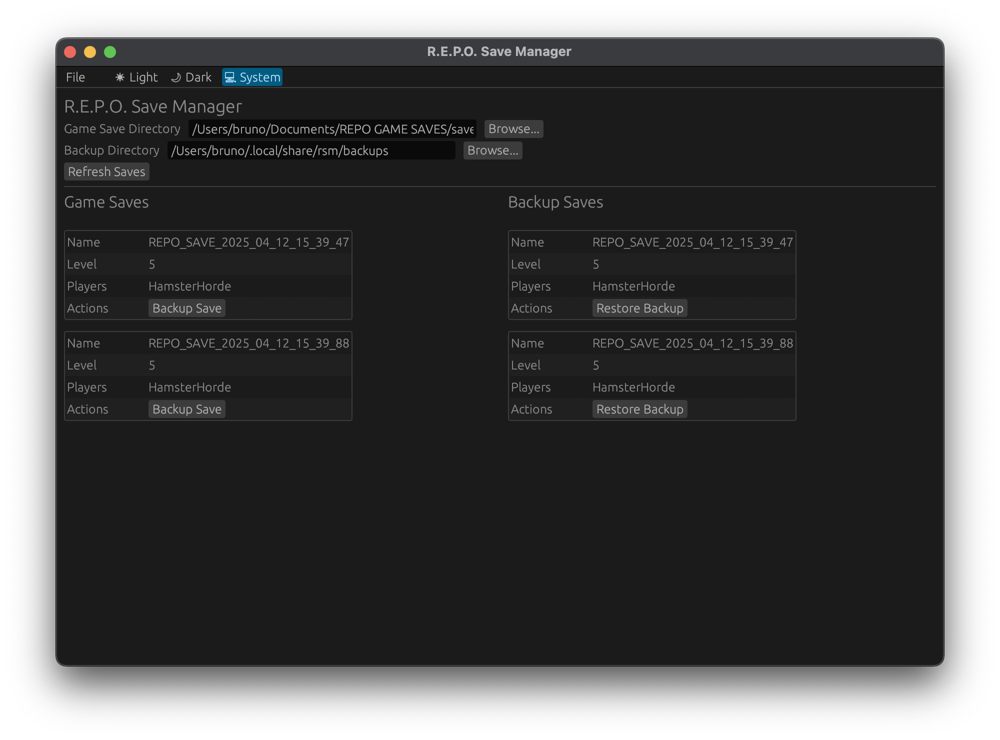

# REPO Save Manager

Repo save manager (RSM) is a GUI application, built in rust.
It allows you to view, backup and restore your saves.



Currently supported platforms are

- Windows (x86)
- Linux (x86)
- MacOS (apple silicon)

# Installing

## Installing from package manager

### cargo

`cargo install repo-save-manager`

## Compiling from source

**pre-requisites**

- Rust (cargo) installed on your system. See [installing rust](https://www.rust-lang.org/tools/install).

**Instructions**

1. clone the project to your computer with `git clone https://github.com/bruno-robert/repo-save-manager.git`
2. inside the project directory, run `cargo build --release`
3. locate the executable in `$project_dir/target/release/rsm.exe` (windows) or `$project_dir/target/release/rsm` (linux/macos)
4. run the executable

## Manual Install

1. Go to the [releases page](https://github.com/bruno-robert/repo-save-manager/releases)
2. Download the release for your platform
3. (linux/macos) Make the binary executable
4. Run the binary

# Usage

First, you should make sure the "Game Save Directory" field is set to point to the directory where your game saves are stored.
See the Common Save File Locations section for more information.

Then, you can click the "Refresh Saves" button to refresh the list of game saves and backup saves.

In the left pane - the "Save" pane - you have a list of game saves you can backup.
In the right pane - the "Backup" pane - you have a list of backup saves you can restore.

Each save has a buttons you can click to perform actions such as backing-up, restoring, etc.

## Common Save File Locations

These are the default locations of save files depending on the platform you are on.

### Windows

- `C:\User\username\AppData\LocalLow\semiwork\Repo\saves`
  You can find the above path by pressing `Win + R` to open the run dialog. Then entering `%USERPROFILE%\AppData\LocalLow\semiwork\Repo`

### linux

- `~/.steam/debian-installation/steamapps/compatdata/3241660/pfx/drive_c/users/steamuser/AppData/LocalLow/semiwork/Repo/saves/`

# Contributing

## Cross-Compiling from M1 MacOS

### For linux

[Source Guide](https://medium.com/better-programming/cross-compiling-rust-from-mac-to-linux-7fad5a454ab1)

```sh
rustup target add x86_64-unknown-linux-gnu
brew install SergioBenitez/osxct/x86_64-unknown-linux-gnu
```

Add to `~/.cargo/config.toml`

```toml
[target.x86_64-unknown-linux-gnu]
linker = "x86_64-unknown-linux-gnu-gcc"
```

Build
`cargo build --release --target x86_64-unknown-linux-gnu`

### For Windows

Install [cargo-xwin](https://github.com/rust-cross/cargo-xwin) and use it.

```sh
cargo install --locked cargo-xwin
rustup target add x86_64-pc-windows-msvc
cargo xwin build --release --target x86_64-pc-windows-msvc
```
